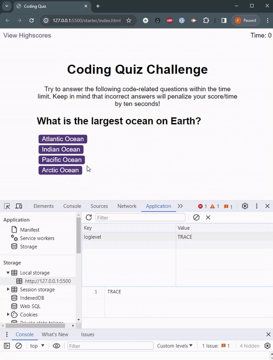
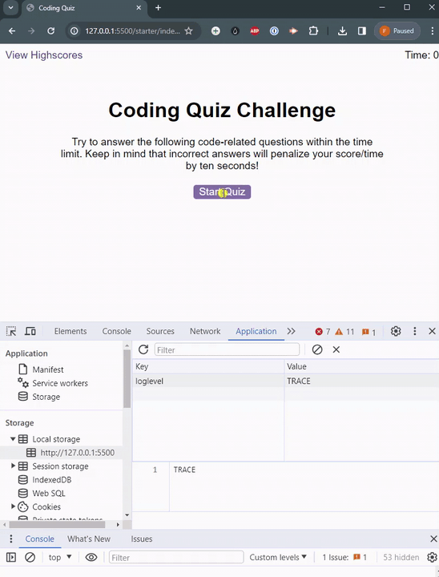
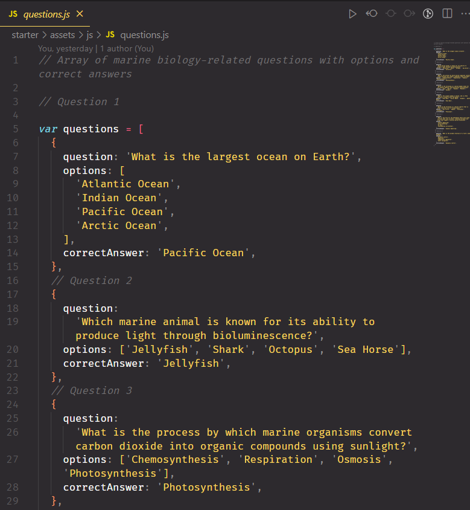
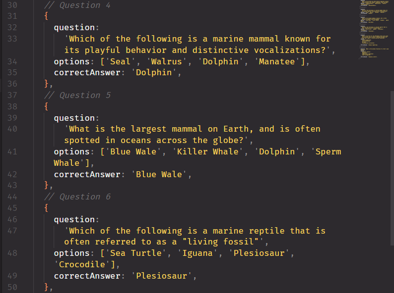
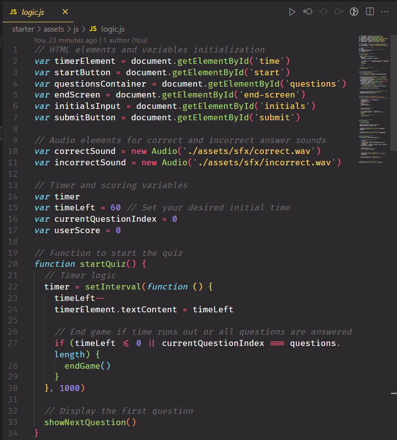
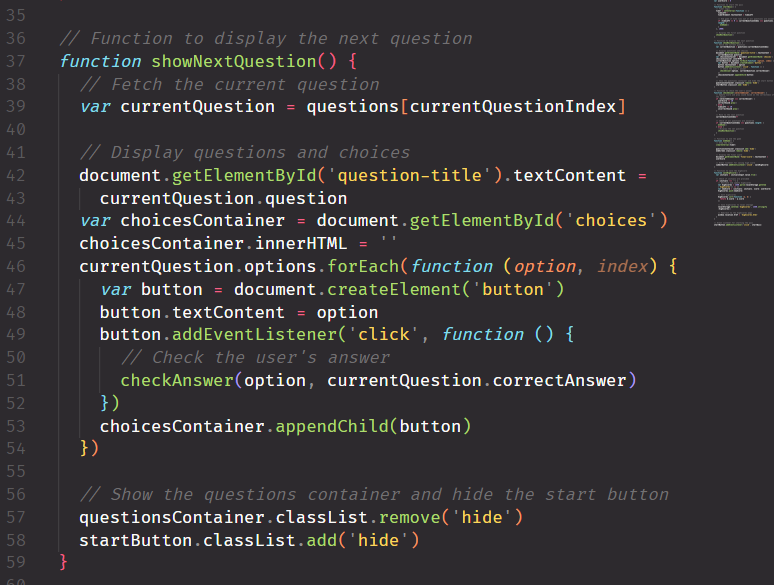
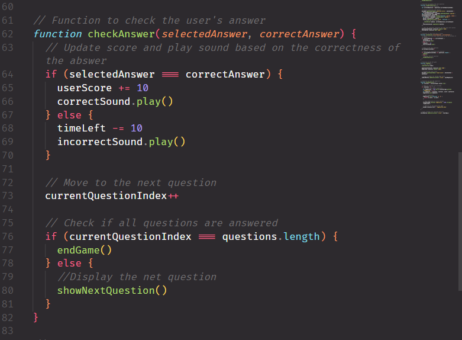
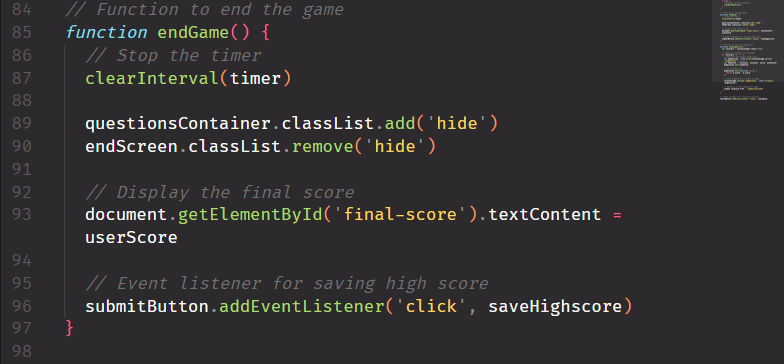
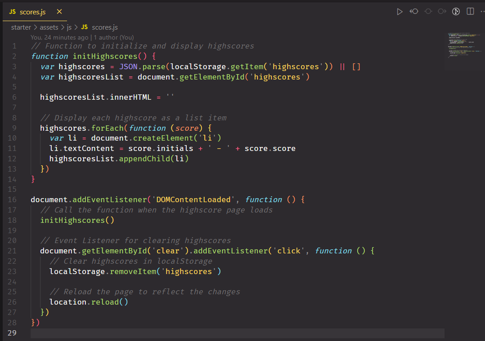

# aquatic-knowledge-challenge

## Description

Dive into the fascinating world of marine biology with the Aquatic Knowledge Challenge Quiz. This interactive and educational quiz challenges your knowledge of marine life, featuring engaging questions and new enhancements for an even better experience. This project provided a hands-on opportunity to reinforce my web development skills. The incorporation of instant feedback, visual enhancements, and diverse difficulty levels expanded my knowledge of creating engaging and educational quiz applications. I delved into timer animations, sound effects, and accessibility considerations to ensure an inclusive experience for all users.

## Table of Contents

-   [Installation](#installation)
-   [Usage](#usage)
-   [Features](#features)
-   [How-to-Play](#how-to-play)
-   [Technologies-Used](#technologies-used)
-   [Credits](#credits)
-   [License](#license)

## Installation

N/A

## Usage

### Features

-   Engaging questions about marine biology
-   Timed quiz with visual cues for an exciting challenge
-   Highscores tracking to gauge your progress
-   Immediate feedback on correct and incorrect answers
-   Enhanced timer with dynamic animations
-   Diverse difficulty levels for a broad audience
-   Visual elements and sound effects for a more immersive experience

### How to Play

1. Click "Start Quiz" [aquatic knowledge challenge][1] to begin the timed challenge.
2. Answer questions and earn points with instant feedback.
3. Save your initials and score to compete on the leaderboard.

View the website via this link: [aquatic knowledge challenge][1]

## Animated gifs

-   
-   

## Screenshots

-   
-   
-   
-   
-   
-   
-   
-   
-   

## Technologies Used

-   HTML
-   CSS
-   JavaScript

## Credits

-   Handled some debugging issues during tutoring session with David, Elutilo
-   Discussion with colleagues during breakout room sessions

### List of third-party assets.

-   Starter Pack
-   Stackoverflow: https://bit.ly/stackoverflow-functions
-   TinyMCE Blog: https://www.tiny.cloud/blog/javascript-localstorage/
-   w3schools: https://www.w3schools.com/jsref/prop_win_localstorage.asp
-   Medium: https://bit.ly/medium-local-storage

## License

-   Please refer to the repo

[1]: https://francis-gomes-esq.github.io/aquatic-knowledge-challenge/
